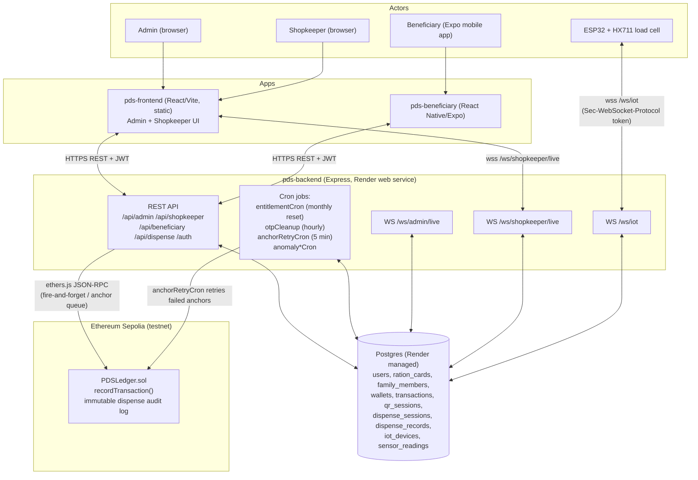
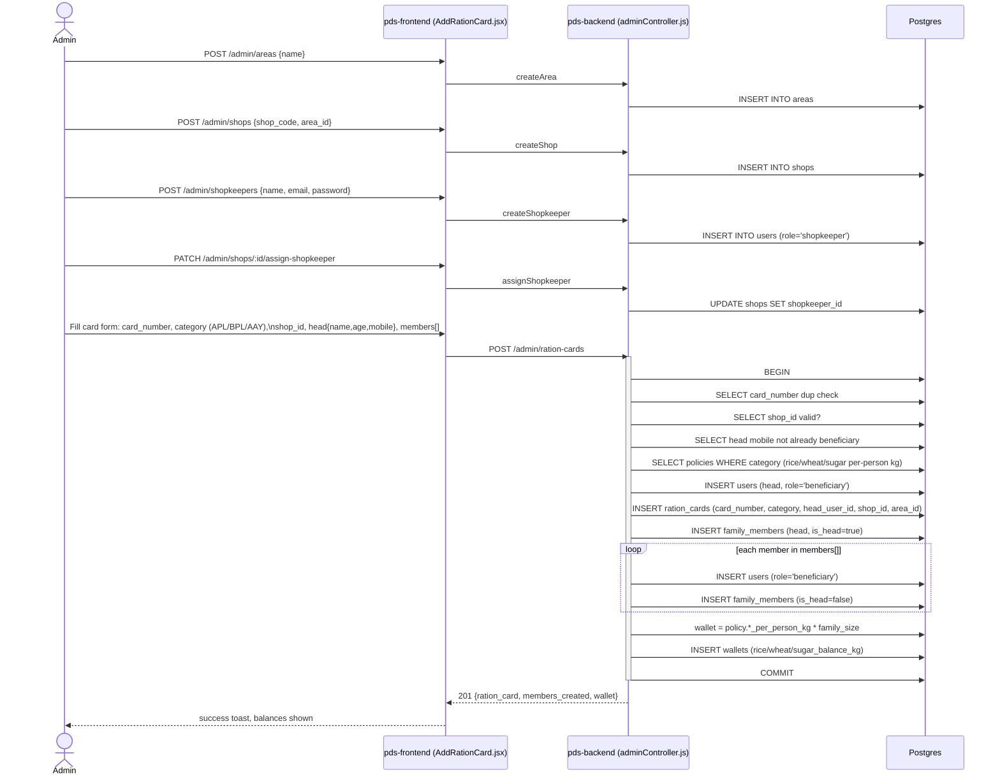
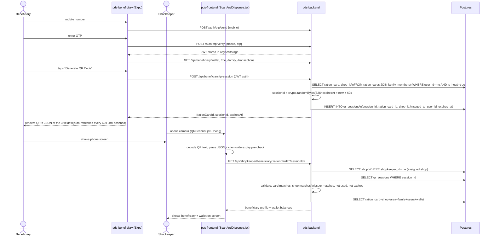
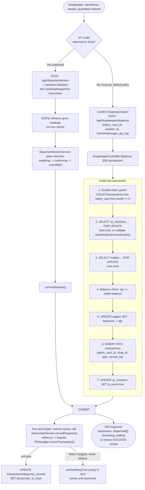
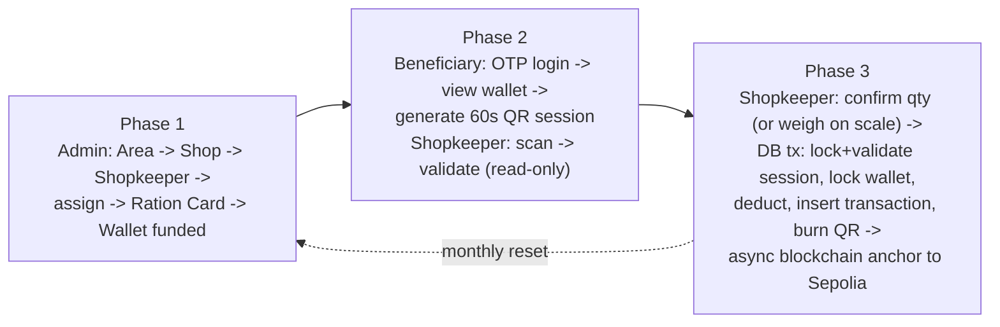

# PDS Architecture: Admin Ration Card Creation → Successful Dispense

Source of truth for this document: current code in `pds-backend`, `pds-frontend`, `pds-beneficiary`, `blockchain`, `iot-device`, and `schema.sql`. Built for turning into flow/sequence diagrams — every step below names the actual endpoint, file, and DB table involved.

---

## 0. System Components (reference for a component/architecture diagram)

**Deployment topology** (`render.yaml`): `pds-backend` (Node web service) + `pds-frontend` (static site) + managed Postgres all on Render. `pds-beneficiary` is not deployed anywhere — it runs via Expo Go on a phone pointed at the backend host. The `blockchain` contract is deployed once to Sepolia (`PDSLedger` at `0xD3A989A423FDB3cF28024D1c67aaC04e4743e5B4`) and is called over RPC from the backend, not co-hosted. The `iot-device` is physical ESP32 firmware on-site at a shop, not a hosted service.

---

## Phase 1 — Admin Setup & Ration Card Provisioning

**Goal:** get a beneficiary family onto the system with an active ration card and a funded wallet.

**Prerequisite order** (each step depends on the last): Area → Shop (in that area) → Shopkeeper (user) → assign Shopkeeper to Shop → Ration Card (picks a shop, which implies the area) → wallet auto-created from policy.

| Step | Endpoint | Key file | Tables written | Tables read |
|---|---|---|---|---|
| Create area | `POST /api/admin/areas` | `adminController.js:486` | `areas` | — |
| Create shop | `POST /api/admin/shops` | `adminController.js:644` | `shops` | `areas` |
| Create shopkeeper | `POST /api/admin/shopkeepers` | `adminController.js:743` | `users` | — |
| Assign shopkeeper→shop | `PATCH /api/admin/shops/:id/assign-shopkeeper` | `adminController.js:579` | `shops` | `users`, `shops` |
| **Create ration card** | `POST /api/admin/ration-cards` | `adminController.js:16-156` `createRationCard` | `users`, `ration_cards`, `family_members`, `wallets` | `ration_cards`, `shops`, `users`, `policies` |
| Bulk variants | `/ration-cards/bulk`, `/shops/bulk`, `/shopkeepers/bulk`, `/family-members/bulk` | `adminController.js:823-1221` | same tables, row-by-row | same |
| Integrity check | `GET /api/admin/validation/integrity` | `adminController.js:1223` | — | `ration_cards`, `wallets`, `family_members`, `transactions` |

**UI path:** `pds-frontend/src/pages/admin/RationCards.jsx` → "Add Ration Card" → `AddRationCard.jsx` (area select → shop select → head/member form) → submit → back to list.

**Recurring maintenance in this phase's domain:** `entitlementCron.js` runs monthly (1st, 6AM Asia/Kolkata) and resets every wallet to `policy.*_per_person_kg × family_size` (idempotent via `last_reset_date`). This is what "refills" a card's wallet each month after Phase 1 has provisioned it once.

---

## Phase 2 — Beneficiary QR Generation & Shopkeeper Validation

**Goal:** beneficiary proves who they are and which shop they're entitled to, without the shopkeeper having standing access to card data — a short-lived, single-use QR session is the hand-off token.

**Notes for the diagram:**
- The scanner-side validation (`GET /api/shopkeeper/beneficiary/:rationCardId`) is **read-only / advisory** — it does not mark `qr_sessions.is_used`. The authoritative check happens again inside the dispense transaction in Phase 3.
- QR payload is exactly `{ rationCardId, sessionId, expiresAt }`, generated in `pds-beneficiary/src/screens/QRScreen.js` and parsed in `pds-frontend/src/pages/shopkeeper/ScanAndDispense.jsx`.
- One `qr_sessions` row is scoped to one ration card + one shop + a 60-second window — this is the core anti-fraud control (a QR can't be reused, replayed elsewhere, or used after it expires).

| Step | Endpoint | Key file | Tables touched |
|---|---|---|---|
| OTP login | `POST /auth/otp/send`, `/auth/otp/verify` | `routes/auth.js`, `otp_verifications` table | `otp_verifications`, `users` |
| Wallet/profile fetch | `GET /api/beneficiary/{me,wallet,family,transactions}` | `beneficiaryController.js` | read-only |
| Generate QR | `POST /api/beneficiary/qr-session` | `beneficiaryController.js:142-183 createQrSession` | insert `qr_sessions` |
| Scan + validate | `GET /api/shopkeeper/beneficiary/:rationCardId` | `shopkeeperController.js:84-205` | read `qr_sessions`, `ration_cards`, `wallets`, etc. |

---

## Phase 3 — Dispense Execution & Settlement

**Goal:** atomically deduct the wallet, log an immutable transaction, burn the QR session, and anchor the record on-chain — with an optional IoT weighing sub-flow layered on top of the same session.

**Manual path (default, no IoT hardware needed) — the "happy path" for the diagram:**
1. Shopkeeper taps **Confirm Dispense** → `POST /api/shopkeeper/dispense` (`shopkeeperController.js:207-469`).
2. Pre-check: reject if this ration card already has a transaction this calendar month ("one dispense per card per month").
3. `BEGIN` transaction; row-lock `qr_sessions` (`FOR UPDATE`) and re-validate session↔card↔shop↔user↔used↔expiry — this is the **authoritative** check (Phase 2's check was advisory only).
4. Row-lock `wallets` (`FOR UPDATE`); verify requested kg ≤ balance for each commodity.
5. `UPDATE wallets` (deduct), `INSERT INTO transactions` (`served_by` = shopkeeper), `UPDATE qr_sessions SET is_used=true` — QR can never be replayed.
6. `COMMIT`.
7. **Outside** the transaction, fire-and-forget call to `blockchainService.recordDispense()` → `ethers.js` → Sepolia `PDSLedger.recordTransaction(transactionId, cardNumber, shopCode, riceQtyGrams, wheatQtyGrams, timestamp)`. This never throws and never blocks/rolls back the HTTP response — if it fails, `transactions.blockchain_tx_hash` simply stays null and the shopkeeper still sees success.
8. Response includes updated wallet balance and transaction id; UI shows the SUCCESS screen.

**Optional IoT weighing path (parallel/alternate, only if a shop has an ESP32 scale registered and online):**
1. `GET /api/dispense/device-status` on the same scanned session — if a scale is live, shopkeeper sees a "Weigh on Scale" option instead of/alongside manual entry.
2. `POST /api/dispense/session` creates a `dispense_sessions` row bound to the QR session's ration card + entitled grams; `POST /session/:id/attach` binds the physical device.
3. ESP32 streams `{"type":"reading","grams":...}` frames at ~10Hz over `wss:///ws/iot`; backend relays live readings to the shopkeeper's browser over `wss:///ws/shopkeeper/live`.
4. `dispenseSessionService` drives a state machine (`weighing → confirming → committed`/`cancelled`/`device_lost`/`failed_insufficient_balance`); on `committed` it performs the equivalent of steps 4-6 above against `dispense_records`/`wallets`, then calls `enqueueAnchor()` (a queued/retried version of the same `blockchainService.recordDispense()` call, retried every 5 min by `anchorRetryCron` if it fails) instead of pure fire-and-forget.
5. Falls back to the manual path automatically if no device is attached or the device disconnects mid-weigh.

| Step | Endpoint | Key file | Tables touched |
|---|---|---|---|
| Manual dispense | `POST /api/shopkeeper/dispense` | `shopkeeperController.js:207-469` | read+lock `qr_sessions`,`wallets`,`transactions`(dup-check); write `wallets`,`transactions`,`qr_sessions` |
| Alt "blockchain-stable" endpoint | `POST /api/shopkeeper/transactions` | `shopkeeperController.js:473-628` | same as above but **skips qr_sessions validation** — legacy/alt integration path |
| IoT session create/attach | `POST /api/dispense/session`, `/session/:id/attach` | `dispenseSessionController.js` | `dispense_sessions` |
| IoT live weighing | `wss:///ws/iot` (device), `wss:///ws/shopkeeper/live` (browser) | `ws/iotSocketServer.js`, `ws/shopkeeperSocketServer.js` | `sensor_readings`, `dispense_sessions` |
| Commit IoT session | `dispenseSessionService.commitSession()` | `services/dispenseSessionService.js` | `dispense_records`, `wallets` |
| Blockchain anchor (manual) | fire-and-forget | `services/blockchainService.js recordDispense()` | `transactions.blockchain_tx_hash` |
| Blockchain anchor (IoT) | queued + retried | `services/anchorEnqueuer.js`, `jobs/anchorRetryCron.js` | `dispense_records.blockchain_tx_hash` / `last_anchor_error` |

---

## End-to-End Summary (all 3 phases chained)

## Known Issues Worth Footnoting on the Diagram

1. **`qr_sessions` schema drift**: `schema.sql` defines `session_id VARCHAR(64)`, but `server.js` boot-time `ensureDatabaseGuards()` creates it as `VARCHAR(150)` with slightly different defaults if the table doesn't already exist — whichever ran first on a given DB wins.
2. **`blockchain_logs` table is unused**: defined in `schema.sql` but no application code writes to it; the real anchor status lives on `transactions.blockchain_tx_hash` / `dispense_records.blockchain_tx_hash`.
3. **Sugar-only dispense never anchors**: `PDSLedger.recordTransaction` requires rice or wheat grams > 0, so a sugar-only dispense silently never gets a blockchain record.
4. **`POST /api/shopkeeper/transactions`** is a parallel dispense endpoint that skips QR-session validation entirely — flagged in code comments as a legacy/"blockchain-stable, do not change" path; worth a dotted-line/alternate-path box rather than merging it into the main dispense arrow.
